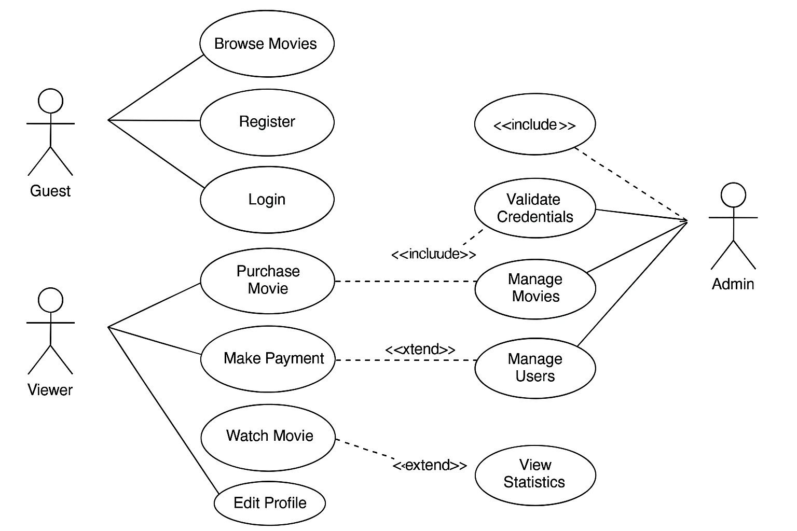
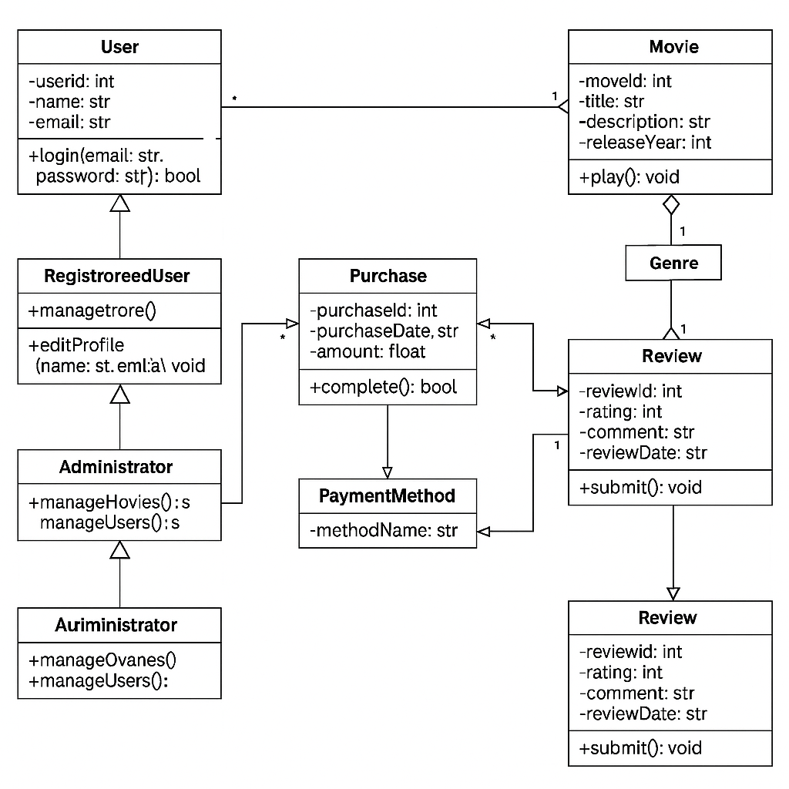
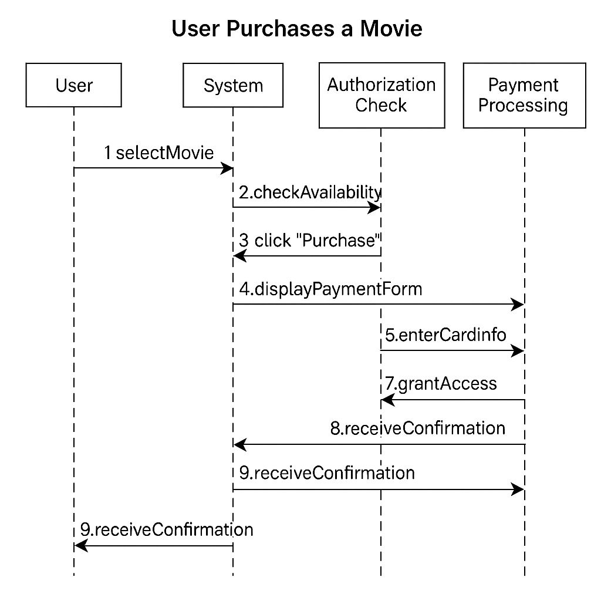
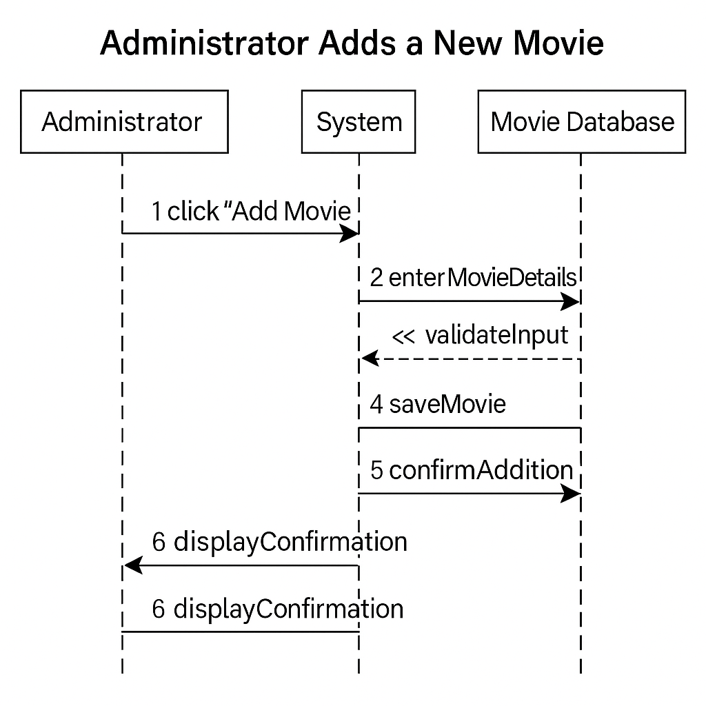
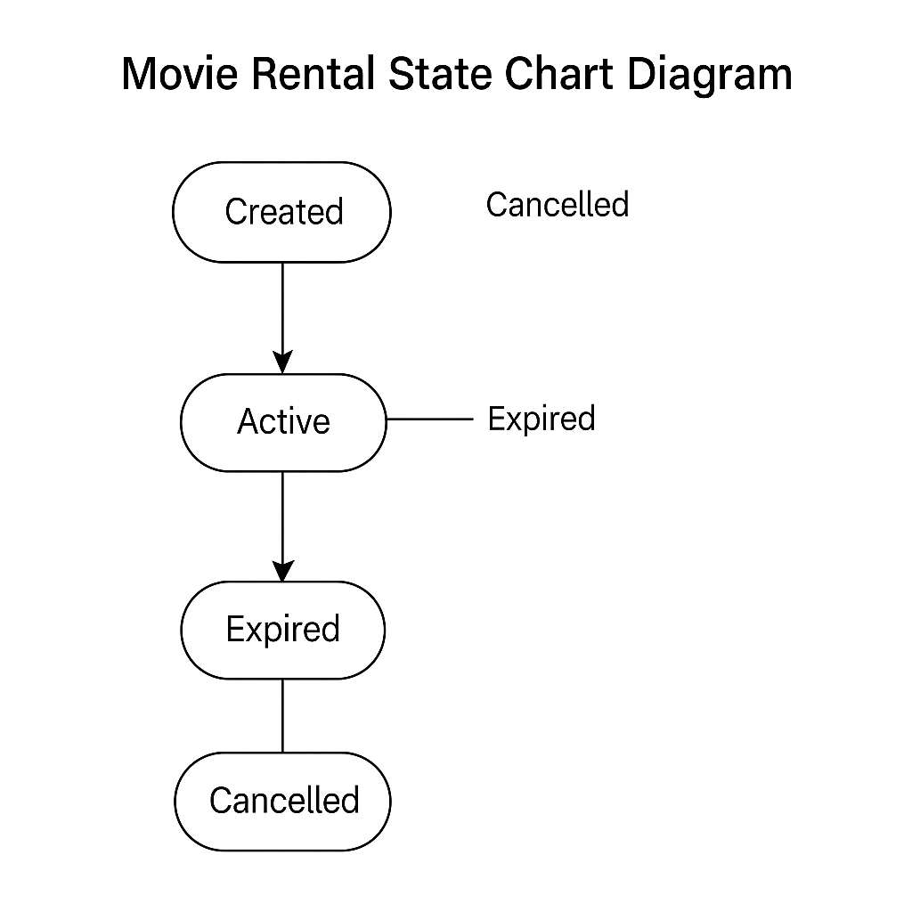

# Online Cinema - UML Project

## System Description
The online cinema system allows users to browse a movie catalog, purchase or rent content for online viewing. It supports two types of users: viewers (registered users) and administrators. Viewers can browse, purchase, rent movies, and leave reviews. Administrators can manage movies, users, and system content.

## Diagrams

### Use Case
- ****
- This diagram shows the main interactions between three actors: Guest, Viewer, and Admin. Key actions include browsing, registering, purchasing, watching, and managing content, with `<<include>>` and `<<extend>>` relationships where appropriate.

### Class
- ****
- The diagram models the system's core classes:
  - `User` – base class with attributes and `login()` method
  - `RegisteredUser`, `Administrator` – inherited classes
  - `Movie`, `Genre`, `Purchase`, `Rental`, `PaymentMethod`, `Review`
  - Associations, inheritance, composition, and one-to-many relationships are present

### Sequence
- **** – illustrates the flow from movie selection to payment confirmation
- **** – describes steps from data entry and validation to saving in the database and receiving confirmation

### State
- ****  
- Demonstrates the rental lifecycle: `Created → Active → Expired`, with a possible transition to `Cancelled` at any stage and `Extended` from `Active`

## Technical Decisions
- The project is based on an **object-oriented model** with clearly separated user roles
- Classes and relationships match the logic of a real-world online cinema system
- Chosen scenarios reflect the most common business processes (purchase, content management)
- The rental object states are modeled according to a typical transaction lifecycle

## Tools
- **UML diagrams** were generated using an AI-based diagram tool in PlantUML style
- **Modeling language:** UML 2.5
- **Additional tools**: manual logic verification, scenario analysis, Markdown documentation generation

---

> Start with Use Case — understand what the system must do  
> Keep it simple — better to have simple and correct diagrams  
> Think like a developer — how would this be implemented in code?  
> Verify the logic — do your scenarios make sense?  
> Document decisions — explain why you chose this approach